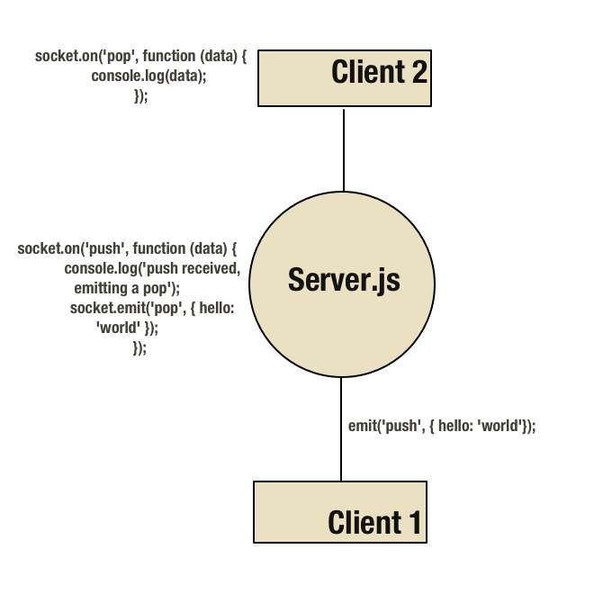
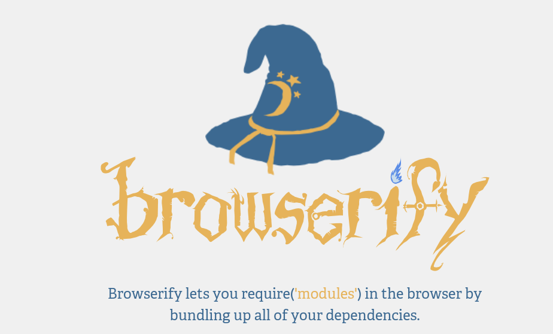

# GitHub and Web Development Workshop
 
 Hosted by Evan Bonsignori @ebonsignori
 
 April 5, 2018 (Thursday)
 
 12:30 - 2 PM
 
 Science Center, Room 1503A

## Prerequisites

- A laptop

- An internet connection

- Pizza?

- Very basic HTML / CSS / JS knowledge

We don't have enough time to cover front-end web development, but most of us have been exposed to the basics of these 3 languages at Armstrong. If you haven't seen these languages before, you should be fine, though you should seriously look into learning them. It only takes a few hours to learn the basics.

## What are we doing?
We're going to be deploying a static page to GitHub, and then touching on how to handle a GitHub site's backend with node.js and sockets.

The template for our frontend is derived from [here](https://www.w3schools.com/howto/howto_css_coming_soon.asp).


## Setup
For each of the install links, follow the directions for your operating system. 

0. **Terminal**

    Open your operating system's command line interface (CLI).

1. **Install git**

    Check if git is already installed with `git --version`.
    If it's not, follow [these instructions](https://git-scm.com/book/en/v2/Getting-Started-Installing-Git).

2. **Install Node and NPM**

    [Download Link](https://nodejs.org/en/download/).

3. **Sign Up for a GitHub Account**

    Armstrong's Wifi can be slow, so [signup for a GitHub account](https://github.com/join) while/if you're waiting for downloads.

4. **Verify Installations**

    ```
    git --version
    ```

    ```
    npm --version
    ```

    ```
    node --version
    ```

5. **Choose Project Directory**

    Navigate to the parent directory of where you want to put your working website directory (I use Projects/learning) from your CLI.
    Use `ls` (Linux and Mac) or `dir` (Windows) to list current directories and `cd` to change to a directory.
    

6. **Clone Repo**

    Run the following command (no virus I swar)

    ```
    git clone https://github.com/acmworkshop/acmworkshop.git
    ```
      After cloning, you should have the following directory (./Projects/learning can be anything)

    `./Projects/learning/acmworkshop`

    Make the following directory with your GitHub name

    `./Projects/learning/<my-github-username>`

7. **Get an IDE:**

    If you don't already use Sublime, Atom, Notepad++, or similar, get a lightweight IDE.
    For this example, I'll be using Sublime. I recommend choosing Sublime for now if you're
    downloading over Armstrong's network.

    In the future, make sure to try out the [jetbrains suite](https://www.jetbrains.com/student/)
    while you're a student and can get it for free. I've started using it for all of my development. Java, Python, C++, Javascript, etc. and am hooked.

# Part 1: Git and GitHub
 

## Git


From your CLI, navigate to `./Projects/learning/<my-github-username>`, and run the following command to initialize a git repository.

```
git init
```

`./Projects/learning/<my-github-username>` is now a git repository that isn't tracking any files.

Create the following files.
1. _README.md_
2. _.gitignore_
3. _index.html_

Create the following directories.
1. _css_
2. _js_
3. _img_

To see the changes that git is tracking, type
```
git status
```
Currently, git isn't tracking any files. Let's change this.

Add the README.md to the Repo
```
git add README.md
```
Now README.md is _staged_ to be committed.

A git repository doesn't automatically save each change you make, instead
you have to _commit_ a set of files to save their status at that commit.

Make your first commit. This saves the state of README.md since it's all that has been _staged_.

```
git commit -m "Initial Commit. Add README.md"
```

Now if we run `git status` again, we see that README.md is not listed as untracked, that's because in the current commit (the current version of our save) README.md hasn't been changed. Let's change that.

Open README.md and type a few lines. README.md uses [markdown](https://github.com/adam-p/markdown-here/wiki/Markdown-Cheatsheet) format. This tutorial file was written entirely in Markdown. It's pretty **awesome**.

Copy the following into your README.md file.
```
# GitHub and Web Workshop
This is the text after a heading. **Cool** _right_?

## Progress
- [x] Install needed files
- [x] Initialize git repo
- [ ] Publish my site to GitHub

- Author : <your name>
- Date : 3/29/18
- From : [Evan's Workshop](https://github.com/acmworkshop/acmworkshop)
```
Save README.md and type `git status` again.

Under "changes not staged for commit" you should see README.md. This is
because git is tracking README.md for changes, and README.md has been changed
since the last commit.

Let's add every file in your website to be tracked by git
```
git add *
```

and make a new commit with all of our newly tracked files.
```
git commit -a -m "Update README.md. Add initial project files for tracking"
```
_Note: It's best practice to title your commits as if you were finishing this statement:
"if applied, this commit will ....." in the imperative. More details [here](https://gist.github.com/robertpainsi/b632364184e70900af4ab688decf6f53)_

We can view our commits with
```
git log
```
however, I recommend using GitHub to explore commit history and file changes from a
GUI rather than a CLI. 

## GitHub
Technically, everything we've done so far has not been 'GitHub'. Git is just a version control system, but GitHub can host our git repositories and let us interact with them is incredibly productive ways.

Let's put our local repository on GitHub.

1. Go to GitHub and log into the account that you created earlier.

2. In the top right press the + icon and select "new repository".

3. Name it, **but do NOT initialize with a README, .gitignore, or license.**

4. Press create Repository.

Now we should see the following instructions
```
1. echo "# test" >> README.md
2. git init
3. git add README.md
4. git commit -m "first commit"
5. git remote add origin https://github.com/<your username>/<repo name>.git
6. git push -u origin master
```

You'll notice that we've already completed steps 1 through 4, now it's time
to add a remote URL where we can _push_ our local repo.

```
git remote add origin https://github.com/<your username>/<repo name>.git
```

Type the command, replacing your username and repo appropriately, then push your
repo to GitHub.
```
git push -u origin master
```

You may have to enter your GitHub email and username defaults with,
```
git config --global user.name "Your Name"
git config --global user.email "Your GitHub email address"
```
Set them and try pushing master to origin again.

If you visit your repository and press the commits button, you can explore
the changes we've made with git diff, and check out the entire filesystem of our
repository at any previous commit.


# Part 2: NPM, Node, and browserify
## NPM
Start a node project. If you don't understand why we are installing stuff, just
trust me for now. _Yeppp All viruses._

`npm init`

For creating a socket from backend to front-end

`npm install --save socket.io`

Install http-server for starting an easy local development server

`npm install -g --save-dev http-server`

Install browserify for running node.js code on our frontend

`npm install -g --save-dev browserify`

_You may have to use sudo if you use the '-g' (global install) flag_

Notice that we now have a node_modules directory containing all of the npm
libraries that we installed along with the standard node.js libraries that are
downloaded from `npm init`.

### .gitignore
We add local files to .gitignore, so that when we type `git add *` git ignores
files much like I'm ignoring Hashemi's database project.

...

Ok. Let's make sure to add `node_modules` to .gitignore, because GitHub really isn't a dropbox, and uploading dependencies is bad practice.

### package.json
When you develop, you're likely going to use GitHub not only for version control,
 project storage, and open-sourcing your code but also for collaboration. This is why we ignore certain files that we only need locally or for development.

The package.json file generated by the fields that you filled out when prompted
by `npm init` contains dependencies for your project. Whenever you run `npm install` with
the `--save` flag, the dependency you installed is added to package.json. When you use the `--save-dev` flag, the dependency you installed is only used for development, and not by build tools for production.

### Getting the Front-End of Our Project From A Template
As a web developer, you will reuse a LOT of components. Actually, as pretty much any
type of developer you will reuse a lot, but in web design, there are plenty of free and easily
accessible components available to us. I've included some links to places where you can find pre-made stuff [here](###Pre-made-Website-Templates-and-Components).
 
 For our countdown page, we will copy the code found at [w3school's tutorial]('https://www.w3schools.com/howto/howto_css_coming_soon.asp').


## Image Licence
A huge part of front-end development is finding free-to-use images with licensing that
won't get you into trouble. You can use any of the free image sites [in the appendix](###License-Free-Image-Sites) to grab a background for your count-down page.

## Deploying The Development Server
Earlier we installed http-server using npm, now we can run http-server to start a local
development server. The following command starts an http-server in the current
directory '.' at address 'localhost' on port '9070', and the flag '-o' opens your default web-browser
 at the appropriate address. The port can be nearly anything that you aren't already using.
```
http-server . -a localhost -p 9070 -o
```
If this command doesn't work, it's probably because you didn't do an npm global install
with the -g flag. A workaround is to run http-server from its location with
```
./node_modules/http-server/bin/http-server . -a localhost -p 9070 -o
```

# Part 3: Deploying to GitHub and Using Socket-io

## Deploy to Github
First, make sure to add all the files that you've modified to be staged for a commit with
```
git add *
```
Second, commit the files to a new commit
```
git commit -a -m "Add template files for countdown page"
```
Finally, push the repository to Github
```
git push
```
You'll use this sequence of commands fairly frequently when working with GitHub, so make sure you understand what each is doing. 

Now, go to your repository on [GitHub.com](https://github.com/) and go to the settings tab.

Scroll down until you see "GitHub Pages", then select the master branch as the source of your page.

Usually, if your repository wasn't named after your account, you would need to append all of your href links with the name of your project. Or, configure a .yml file named _config.yml in your home directory with the baseurl option.

Another option, which we will use in this tutorial (since it is one of the
best ways to get a decent domain name) is to use the name of your user account as the name of your repository.

Change the repo name to your Github username if it isn't already, and visit 
`<yourGitHubname>.github.io` to see your site.

Alright! **Well done**, you just pushed a static site to GitHub! 

Your site could even appear in a Google search if you wanted it to, though you'd have poor search ranking without any search engine optimization (SEO). 

## Sockets
At this point, change directories to the `acmworkshop` directory where we cloned the GitHub repo,
 and use the files from the cloned repository from this point on.

Uncomment  and comment out the script tags at the end of index.html so that they are as follows:
`<script src="/js/bundled-node.js" type="text/javascript"></script>`
`<!--<script src="/js/main.js" type="text/javascript"></script>-->`

Run `npm install` from the CLI in the `acmworkshop` directory to install the dependencies needed to run server.js.

We need a server to run and listen for socket-io `emits`. This is in our `server.js` file. Read the file and see that after we connect socket io with `io.connect(...`,
the socket listens for an emit called _'subscribeToTimer'_ `client.on('subscribeToTimer'...`

Now visit `js/front-end` to see how we connect to our socket with `var socket = io.connect('http://localhost:8005');` 
on the port that we chose to listen on in server.js with `const port = 8005;` 

### Running node Libraries on The Front-end
Node.js extends javascript to be a backend language. Node files can be run from the command line with a simple
 `node filename.js` command. We can even host an entire backend with node.js
 running locally on our machine, or on remote hosting. Node.js can interact with
 SQL and NoSQL databases and do just about everything that other backend languages can do.

We can run a lot of node.js code (in our case socket-io) in the frontend using libraries like browserify.

Browserify bundles / builds / converts into a node js file.

How it does this?



Yeah, magic as far as we know, but also with this command: 
```
browserify node.js -o ./js/bundled-node.js
```

### Start the Front-end
I've included a script that executes the command that bundles anything you write in `js/frontend-node.js` to `js/bundles-node.js` in package.json. 
Simply run `npm run-script build` and then `npm run-script start` to start a local server on port 9070 like we did earlier.

If we inspect the page and look at the Javascript console we should see something like this:
```
GET http://localhost:8005/socket.io/?EIO=3&transport=polling&t=M9UdmKi net::ERR_CONNECTION_REFUSED
```

This is our socket trying to connect to 8005, but since we haven't set up a backend server that listens on 8005 the frontend is trying to connect to a backend that doesn't exist. Let's change that.

### Seeing Sockets in Action
Run our backend server with and view the results in our browser
``` 
node server.js
```
We should see our frontend updating the time using the date passed from our server.

Cool, right?

Let's review what is happening:

The frontend server (code in `js/frontend-node.js`) emits a 'subscribeToTimer event every 1000 ms with: `socket.emit('subscribeToTimer', 1000);`
The backendserver (code in `./server.js`) is listening for a 'subscribeToTimer' event with: `client.on('subscribeToTimer'...`
In response to receving the 'subscribeToTimer' event, the backend server emits `client.emit('timer', new Date().getTime());` 
The frontend server is listening for a 'timer' event with: `socket.on('timer')`
In response to receiving a 'timer' event, the frontend code executes lines 13-31 which populates our frontend with the countdown, using the data passing from our server.

### Experimenting Through Expanding Our Simple App
**The following segment is intended for people reading this tutorial outside of the workshop.** In the workshop, we code the contents in `added_contents.txt` live, while explaining what we are doing line by line. 

Feel free to read the code in added_content.txt and place each segment into the specified file (in the preceding comment) at the placeholder in said file.

Example
```
//================================================================================
// index.html
//================================================================================
<form method='post' id='input-form'>
    <input type="text" id='user-input' required placeholder="Send Squirrel A Message" />
    <input type="submit"/>
</form>
<p id='status'></p>
```

Here we will navigate to index.html and paste everything from `<form method='post'...` to the last closing paragraph, `</p>` into line 40 after the comment, `<!-- Paste added_content.txt Here -->`

Repeat these steps for all three files in added contents.

**Remember to run `npm run-script build` after making any changes to frontend-node.js and to run `npm run-script start ` to view your changes (if your server isn't already running). When using frontend-node.js, make sure a backend server is running with the command`node server.js`.**

If you are having trouble running the backend and server from only one terminal, you may want to open up multiple terminals to run each command. Alternatively, you can the '&' symbol to any command to run the task in the background in Mac or Linux. The output from the command will still stream to the CLI, but you can still enter new commands. To prevent output streaming, you can do the following, with `npm start` as an example.
```
(echo `npm start` &)
``` 
Where ` are back-ticks around the command. 

## Hosting A Server
In practice, you could upload your server.js file to remote hosting and set your github.io page's javascript file to listen to the hosting's domain and port. In our example we listened
to the address "localhost" and the port "8005". "localhost" is really an alias for 127.0.0.1 or 10.0.0.1, which is your local IP address. Whenever you type a domain name such as www.google.com into the address bar, there is an underlying IP address that the domain name actually points to. When you create a remote server on some hosting service, you will be given an IP and port from which your GitHub site can set up a socket to listen to.


### Practical Use of Sockets
In our server.js's current setup, anyone could emit a 'subscribeToTimer' event and receive the time. In this sense, our server is an API. We can keep this functionality if we wanted our app to have API capabilities, or we could only allow socket connections from our GitHub web page.

After only allowing connections from our GitHub page, server.js can truly act as a backend for our frontend page. We could interact with a database from server.js and get the
results of queries through sockets. The possibilities are nearly endless. 

If you'd like to setup your own server, I highly recommend starting with Digital Ocean. As a student, you can get a $50 credit using [GitHub student]('https://education.github.com/pack'), which gives you 10 months of free $5/mo hosting. 

Digital Ocean is filled with incredibly easy to follow tutorials for complex tasks. [Here is an example](https://www.digitalocean.com/community/tutorials/how-to-create-your-first-digitalocean-droplet) of setting up an Ubuntu droplet, which you could then install node onto to run our server.js.

## Closing
The inspiration for this workshop came from open-source contributions that I've made to [ForkDelta]('https://forkdelta.github.io/#!/trade/DAI-ETH'). They host their website on GitHub and use
sockets to connect to their backend. These same sockets on their backend provide an API for other developers to use. 

ForkDelta is a great example of how GitHub is more than the portfolio and project storage that some people think it is. GitHub can be used for project management, issue logging, team communications, and much more. Submitting issues for your project can be open to the public and developers can be assigned to fix them.

Or you could attempt to yourself with a pull request. Pull requests are ways to make changes to a project's code, but those changes are only merged to the project's production code after reviews and approval. 

Even if you end up in a job doesn't use GitHub (a lot of places are now), they're likely to use similar concepts for project management. If you find yourself with some free time and want to expand your resume while learning a lot of cool new things, I recommend finding an open source project like [Forkdelta](https://github.com/forkdelta) and contributing to it.

# Appendix
## Goodies
- [GitHub Student](https://education.github.com/pack)
- [JetBrains Student](https://www.jetbrains.com/student/)
- [Git Cheat-Sheet](https://services.github.com/on-demand/downloads/github-git-cheat-sheet.pdf)
- [.gitignore Templates by Project](https://github.com/github/gitignore)
- [Git Commit Best Practices](https://gist.github.com/robertpainsi/b632364184e70900af4ab688decf6f53)

### Pre-made Website Templates and Components
- [Components on Codepen]('https://codepen.io/')
- [Static Sites on HTML5UP]('https://html5up.net/')
If you want to learn bootstrap:
- [Colorlib top 40]('https://colorlib.com/wp/free-bootstrap-landing-pages-templates/')

### License-Free Image Sites
- [pexels]('https://www.pexels.com/')
- [pixabay]('https://pixabay.com/')
- [freeimages.co]('http://www.freeimages.co.uk/galleries.htm')

    Free icons are incredibly useful too:
- [Icons at flaticon]('https://www.flaticon.com/search?word=folder')

## Terms
- NPM : [Node Package Manager](https://www.npmjs.com/)
- CLI : [Command Line Interface](http://www.linfo.org/command_line_interface.html)
- Repo: [Git Repository](https://www.sbf5.com/~cduan/technical/git/git-1.shtml). This is essentially your git project. It has version control, the ability to push and pull
         to and from GitHub, and automatically tracks changes of anything inside of it.
- JSON: [JavaScript Object Notation](https://www.w3schools.com/js/js_json_intro.asp). The easy-to-read syntax for storing and saving data that can be parsed by JS and now many other languages.
